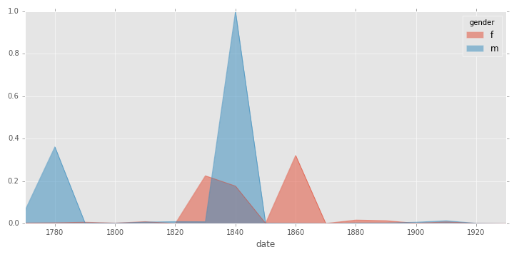

#Introduction 
How do we define literary modernity? Critics have used a variety of measures to distinguish the modern period in literature from earlier or later periods: the changing political landscape, the rise of the age of mechanical reproduction, and the development of new media like cinema, just to name a few. One of these metrics, one that appears often in discussions of periodization, is a change of attitudes toward religion and myth. The following describes a series of experiments in quantitative literary analysis, whereby an algorithmic approach to the detection of allusions to Biblical and classical myth is applied to a corpus of novels ranging from the late 18th century to the early 20th century. This experiment will attempt to test the mythological and religious basis of the periodization of modernity by detecting intertextuality with the Christian Bible and references to Greek and Roman mythological figures. 

If a fascination with myth, both Judeo-Christian and classical, can be shown to be a characteristic of modernism, then by detecting allusions to myth, we might also be able to detect the boundaries of modernism as a literary period. This might contribute empirical evidence, however qualified, towards settling the critical debate over the boundary years of the period. In one sense at least, we might be able to better answer the question, “when was modernism?”. If it is true, as Eric Hayot argues in _On Literary Worlds_, that unexamined cultural periodization “reinforces a presentist and dissociative form of historical thinking that makes the world a less good, more stupid place to live in,” then attempting to experimentally test the boundaries of what we understand to be modernism might help us to more holistically conceptualize its continuum [@hayot_literary_2012 168]. Furthermore, if we believe Virginia Woolf's strikingly specific notion that “on or about December 1910 human character changed,” we might be able to see this reflected in the uses of literary myth in that year [@woolf_selected_2008 38]. 

Of course, the following experiment will not presume to detect all allusions, or even the majority of allusions in a given novel. A comparison of [the detected intertextualities](https://github.com/JonathanReeve/text-matcher/blob/master/results/cenlab-txtmatch-wsw-experiment.txt) with manually-created catalogs of allusions, such as Brendan O'Hehir's _Classical Lexicon_ of Joyce's works, will show just how few of a novel's total allusions are detected by the procedures outlined below [@ohehir_classical_1977]. Even so, trends gathered from the results of these procedures might still be shown to correlate with greater literary historical trends.

##Modernist Disillusionment, Mythopoetics

The early twentieth century saw a great disillusionment with organized religion that had been building for at least half a century. Nineteenth-century scientific discoveries, such as the uniformitarian geology of Charles Lyell and the evolutionary theory of Charles Darwin, contributed to a generalized loss of faith in the literal claims of the Bible. When combined with the historical Biblical hermeneutics of the Higher Critical school of David Strauss and Ernest Renan, the Bible came to be viewed rather as a source of mythology than of history. Somewhat paradoxically, this loss of faith resulted in a renewed artistic interest in the Bible and in Christian mythology. As Norman Jones argues, 

>One effect of the Higher Criticism is that it made the Bible appear surprisingly relevant to modern literature. During the early decades of the twentieth century when artists were embracing collage as a distinctively modern art form, readers informed by the Higher Criticism could see the Bible itself as a collage. T.S. Eliot's _The Waste Land_ (1922) and William Faulkner's _The Sound and the Fury_ (1929) exemplify how modernist literary experiments with collage-like fragmentation effects could find inspiration in the Bible. [@jones_bible_2016 55]. 

Some critics try to explain this phenomenon through the personal pieties of modernist authors. Suzanne Hobson, for instance, details the Christian or Jewish upbringing of most of the canonical modernists, Virginia Woolf being the notable exception [@hobson_religion_2014 17]. Modernist engagement with religious text, however, does not necessarily reflect personal belief. As Ward Blanton points out, “one reason the Bible was of such perennial interest to modern literature was for the ‘sense of repulsion’ various moderns ... experienced or wanted to cause others to experience through their own literary engagements with these texts” [@blanton_introduction_2012 605].

Although Biblical and classical allusion are as old as the myths themselves, this renewed interest in myth has been a modernist trait since its inception. François-René, Vicomte de Chateaubriand, is often credited with coining the term _modernité_ in his memoirs by writing “the vulgarity, the modernity of the custom-house and the passport formed a contrast with the storm, the Gothic gate, the sound of the horn and the noise of the torrent” [quoted in @rabate_ghosts_1996 2]. This particular juxtaposition---the diachronic contrast of modern bureaucracy with the romantic image of the storm and the Gothic gate---is one that also serves to create the tension between the modern Dublin day of James Joyce's Leopold Bloom and his Greek mythological analogue, Odysseus. Chateaubriand's style of allusion here, as well as Joyce's, is one whose irony highlights the difference between the classical age and the modern, effectively creating the category of modernity through this contrast. This view is confirmed several pages later in Chateaubriand's memoir, when he imagines himself as Odysseus: “I perceive, in fact, that this part of my Memoirs is nothing less than an Odyssey: Waldmünchen is Ithaca; the shepherd is the faithful Eumaeus with his swine; I am the son of Laertes, returning after wandering on land and sea” [-@rabate_ghosts_1996 2-3]. Chateaubriand's mock-heroic style implies that the world in which he wanders is a sort of anti-classical age.

Other critics see the modernist fascination with myth as an answer to the ever-expanding scientific worldview of the era. Erik Tonning defines modernism as “a generalized revolt against even the _intuition_ made possible by a secularizing modernization that we are spiritual orphans in a godless and ultimately meaningless universe” [-@tonning_modernism_2014 xiii]. In 1960, Harry Levin answers the titular question of his paper “What Was Modernism?” by saying, in reference to James Joyce's novel _A Portrait of the Artist as a Young Man_, that “Joyce's young artist, Stephen Dedalus, pledged himself to create the ‘uncreated conscience of his people. Has it not been the endeavor of his generation to have created a conscience for a scientific age?” [-@levin_what_1960-2 630]. Woolf's famous critique of H.G. Wells, Arnold Bennett, and John Galsworthy is that these novelists are “materialists,” who are “concerned not with the spirit but with the body” [@mcneille_modern_1984 158]. In contrast, she praises James Joyce as stylistically “spiritual,” since “he is concerned at all costs to reveal the flickerings of that innermost flame which flashes its messages through the brain” [-@mcneille_modern_1984 161]. 

The “spiritual” dimension Woolf describes is not merely stylistic, but also manifests itself among modernist authors in the thematic interest in classical myth, non-Western religion, and the occult. This is not as simple as primitivism, or a nostalgia for a pre-technological, pre-scientific time. As Shanyn Fiske explains, science and myth are cooperating, rather than competing, forces in modernism, where “the archaic world was formulated and made available for modernist usage by the unique conditions that grafted the development of science---particularly the fields of anthropology, sociology and psychology---onto the well-established roots of classical scholarship” [-@fiske_ritual_2013 174]. Citing the work of Sigmund Freud, James Frazer, and Jane Harrison, Fiske argues for a “dialectical relationship between mythic thought and enlightenment,” whereby nineteenth-century scientists “draw from their well-stocked literary minds to capture and reoccupy the mythopoeic imaginations responsible for the generation of myth.” 

T.E. Hulme, writing in 1924, explains the resurgent attention to mythological themes as a “classical revival” to be expected “after a hundred years of romanticism” [-@hulme_romanticism_1924 113]. However, by opposing romantic and classicist periods, he does not simply imply that modern classicism is a sober Platonic antidote to the _Sturm und Drang_ of romanticism: 

>It would be a mistake to identify the classical view with that of materialism. On the contrary it is absolutely identical with the normal religious attitude. I should put it in this way: That part of the fixed nature of man is the belief in the Deity. ... It is parallel to appetite, the instinct of sex, and all the other fixed qualities. Now at certain times, by the use of either force or rhetoric, these instincts have been suppressed ... The inevitable result of such a process is that the repressed instinct bursts out in some abnormal direction. So with religion. [-@hulme_romanticism_1924 118]

Indeed, modernist writers needed replacements for the faith they had lost. Wallace Stevens, writing in 1940, muses that “it is a habit of mind with me to be thinking of some substitute for religion ... My trouble, and the trouble of a great many people, is the loss of belief in the sort of God in Whom we were all brought up to believe” [quoted in @lewis_religion_2005 19]. Arguably the most influential of these religious substitutes was James Frazer's monumental anthropological compendium _The Golden Bough_. Robert Fraser suggests that the book is “in effect and structure ... a sort of counter-Bible,” suggesting that the work's equal treatment of Christian and non-Western myth and ritual subverts Christian claims to primacy [@frazer_golden_1998 xxv]. Patrick Parrinder situates Frazer's work among that of William Butler Yeats, D.H. Lawrence, and Sigmund Freud, arguing that it “owes much of its fragile grandeur to the attempt to write a Bible or sacred book for modern, post-religious humanity” [-@marcus_cambridge_2004 17]. It is perhaps this quasi-Biblical quality of the book that led T.S. Eliot to call it “a step toward making the modern world possible for art” [@rainey_ulysses_2005].

The complexity of this modernist mythopoetic tapestry, one which is not reducible to narratives of nostalgia or secularization, is what fuels the present experiment. This experiment does not propose to measure the modernist loss of faith, or to determine who won the centuries long science/religion debates, but to attempt to measure, to however small of a degree, the modernist fascination with myth, and how this might diverge from previous generations of writers, if it does at all.

#The Experiment

##The Corpus
To study the period that spans the birth of modernism, roughly in the late 19th and early 20th century, a textual corpus first needed to be assembled. Since no large corpus of novels was available, one needed to be created[^3]. Two existing corpora, Andrew Piper's [txtLab450 corpus](http://txtlab.org/?p=601 ) and Hendrik De Smet's [Corpus of English Novels](https://perswww.kuleuven.be/~u0044428/cen.htm) (CEN), roughly overlapped with these years, and were combined to produce the CENLab corpus used in the following experiments.

[^3]: The many difficulties of creating such a corpus---selecting, obtaining, and preparing the texts---are discussed in the eighth pamphlet from the Stanford Literary Lab [@algee-hewitt_between_2015]. 

The txtLab450 corpus is a collection of 450 novels, prepared in 2016 for use at McGill University's txtLab. According to the creator, they are “drawn exclusively from full-text collections and thus should not have errors comparable to OCR’d texts” [@piper_txtlab450._2016]. The novels are in English, French, and German, and each labeled with their languages, publication years, authors, and titles, such as `EN_1922_Joyce,James_Ulysses_Novel.txt`[^4]. Only the 150 English-language novels from this corpus were used in CENLab. The dates of publications for this corpus range from 1771 to 1930. [@fig:txtlab-dates] shows the distribution of these dates. Since many of the experiments to follow involve the chronological analysis of novels, this distribution is important to keep in mind, since the data are skewed somewhat by the availability of texts in a certain period. Of course, every effort was made to compute the results in ratios of word counts, but the availability of texts likely has an effect here nonetheless. 

{#fig:txtlab-dates}

[^4]: This feature makes it easy to extract metadata from the filename itself, using the Pandas `DataFrame.apply` method in conjunction with lambda calculus: `tdf['date'] = tdf[0].apply(lambda x: int(x.split('_')[1]))`.

The Corpus of English Novels is a similar collection of 292 novels, each published between 1881 to 1922. This corpus is distributed as part of the [Corpus of Late Modern English Texts, Version 3.0](https://perswww.kuleuven.be/~u0044428/clmet3_0.htm). The filenames here are named similarly to those in txtLab450, although most of the metadata is distributed in an accompanying file. A histogram of the publication dates represented by this corpus is shown in [@fig:cen-dates]. Most of these texts were published around the turn of the century.

{#fig:cen-dates}

These two corpora I then combined into the uncreatively named CENLab corpus that provides the basis for the experiments below. I merged the metadata file from the CEN with metadata extracted from the txtLab filenames using Python's Pandas library, and then enhanced the merged file with data about the authors. I wrote a short script to download the Wikipedia article for each author in the corpus and convert the resulting HTML to plain text. These files were then used to populate a table with each author's gender and nationality, roughly categorized as British, American, and Canadian. From there, I wrote a short macro in the Vim text editor to call the Linux command `wc` on the txtLab texts that were missing word counts. 

Since these experiments hope to detect trends that might be revealing about the period of literary modernism, it was necessary to tag each of these texts as “modernist” or “not modernist.” This was the most subjective task in the compilation of this corpus. To start with, the Wikipedia article [“List of English-Language First- and Second- Generation Modernist Writers”](https://en.wikipedia.org/wiki/List_of_English-language_first-_and_second-generation_modernist_writers) was used as a starting-point, to which I added novels by Willa Cather and H.G. Wells. This list of authors was then programmatically compared with the list in CENLab. 

The result of this combination of corpora is [a repository](https://github.com/JonathanReeve/cenlab) containing 441 novels along with [a structured metadata file](https://github.com/JonathanReeve/cenlab/blob/master/cenlab-index.csv) that describes them. This file enables many of the demographic analyses to follow, since this CSV table can easily be programmatically joined with the CSV results of the experiments, producing a unified database of text, publication dates, author information, and experimental results. 

##Intertextuality 

The detection of allusion in literature is a non-trivial computational task. Computers are ideal for comparing two strings for equivalent sequences of characters, but detecting vague or structural allusions is difficult or even impossible for a computer program. Richard Thomas, for instance, describes six different varieties of allusion that appear in Virgil: casual reference, single reference, self-reference, correction, apparent reference, and multiple reference, the latter three of which are difficult to translate into algorithms [-@thomas_virgils_1986 175]. It would be a difficult programming task to write a script that would be able to identify mythical/structural similarities, for instance. Macro-level allusion, such as that between Joyce's _Ulysses_ and its Homeric model, would be nearly impossible to detect. However, detecting sentence- or word-level similarity is much simpler. 

In literary critical terms, this task might be considered the computational detection of intertextuality. As Graham Allen describes it, “texts, whether they be literary or non-literary, are viewed by modern theorists as lacking in any kind of independent meaning. They are what theorists now call intertextual. The act of reading, theorists claim, plunges us into a network of textual relations” [-@allen_intertextuality_2011 1]. For Julia Kristeva, one of the first theorists to present a sustained theory of intertextuality, any text constitutes an intersection of other texts, and which is _created_, in fact, by its relations to other texts [@abrams_glossary_2012 401]. This notion is analogous to the conception of modernism outlined above---that it is that which is formed from the ironic tension between the chaos of modernity and the contrasting order of classicism. Detecting intertextuality, then, might achieve more than simply locating overlapping words---it might help us to understand something fundamental about modernism.

In computer science, intertextuality goes by a number of different names. Since the identification of similar text is often used in detecting plagiarized documents, the algorithms designed to match text often fall under the category of “plagiarism detection.” When plagiarism is not actually involved, such as when journalists reuse material from a newswire, this field of inquiry is termed “text reuse.” A number of papers about text reuse have been published in recent years. Paul Clough et al. describe their METER (MEasuring TExt Reuse) project, where they create a corpus of reused text from journalistic sources, and compare a number of methods for detecting their similarity, eventually settling on the Greedy String Tiling (GST) algorithm [-@clough_meter_2002]. Although GST would not be appropriate for the detection of short matching passages, their methodological analysis was useful in selecting a number of other algorithmic features. David Bamann and Gregory Crane expand Clough et al's argument from text reuse to literary allusion, taking into account “variables for considering the abstract structure of a sentence as well, as represented by its syntax” [-@bamann_logic_2008 2]. This is similar to a technique I use in my detection of X-of-Y and X-of-Xs biblical syntactic structures below. In addition to token similarity, they also use lemma similarity, a concept I also implemented. 

Daniel Bär, Torsten Zesch, and Iryna Gurevych describe a method of detecting text reuse with a composite score aggregated from the three textual dimensions of content, structure, and style, an approach similar to the one I use below [@bar_text_2012]. However, since allusion is decidedly different from both journalistic text reuse and plagiarism, some modifications needed to be made. Their techniques of set-theoretical methods, text tiling, and the comparison of _hapax logomena_ are better suited to comparing texts that have large amounts of similar text, but short quotations might be more difficult to identify with these methods. In the sections below, I present two methods of detecting structural allusions, and one method of detecting text reuse. 

##The Detection of Biblical Superlatives

The translators of the King James Bible preserved a number of the linguistic features of their source texts. One ancient Hebrew feature they retained is the superlative construction NN of NNS, a singular noun followed by “of” and a plural noun [@jones_bible_2016 146]. A well-known example of this construction in the KJV is “king of kings,” a phrase that occurs seven times---in 1 Timothy, 2 Macabees, Daniel, Ezekiel, Ezra, and twice in Revelation---a sampling which represents both Hebrew and Greek[^1]. Similar constructions include “god of gods” (5 occurrences), “lord of lords” (4), “heaven of heavens” (4), “servant of servants,” and “tithe of the tithes,” both of which occur only once. These occur a total of 23 times in the text. The regularity of this construction makes it good candidate for a quantitative literary analysis. 

[^1]: These counts were generated with the command `grep -i PATTERN | wc -l`, using a segmented plain text KJV downloaded from [ebible.org](http://ebible.org/kjv). 

To test for the presence of these constructions, I wrote a Python script, [x-of-xs.py](https://github.com/JonathanReeve/text-matcher/blob/master/x-of-xs.py) that scans a given text for a pattern, and logs the number of occurrences of that pattern. The pattern to be found is the regular expression `(\b(.+?)\b\sof\s\2e?s\b)`. This looks for any word, followed by “of,” followed by the first word, followed by an optional “e,” and ending with “s.” The optional “e” is included to catch -es plurals such as fix/fixes. Granted, this pattern cannot match irregular plurals such as “mice” or “children,” but a quick search of the corpus for unlikely phrases such as “mouse of mice” returns no matches. 

Early tests of this program showed a few false positives, such as “it of its,” as in “he emptied it of its contents.” These I added to a blacklist, so that they are ignored when the program is executed. The adjusted counts I then logged to a file, along with the filenames of the file analyzed, so that the log might be combined with other results for the final analysis.

The novel with the highest number of these superlatives is Gilbert Parker's 1918 _The World for Sale_, in which the phrase “Ry of Rys” appears 38 times. “Ry” is a Romani term which as Parker explains in his appendix “Glossary of Romany Words,” means “king or ruler.” In this respect, “Ry of Rys” is a perfect analog for the biblical “king of kings” [@parker_works_1917 373]. Other matched phrases in the novel include the analogous “queen of queens” and “Gorgio of Gorgios,” both used in the superlative sense. The novel with the second highest number of X-of-Xs superlatives is Francis Marion Crawford's 1885 _Zoroaster_, a novel set in biblical Babylon. Here, there are thirteen instances of “king of kings,” as well as occurrences of the distinctly biblical phrases “song of songs,” “god of gods,” and two instances of “lie of lies.” 
 
The most common X-of-Xs superlative in the corpus is “heart of hearts” with 81 occurrences, a phrase that doesn't occur at all in the KJV, but has its first OED citation from Shakespeare's _Hamlet_: “Give me that man / That is not passion's slave, and I will wear him / In my heart's core, ay, in my heart of heart” [@shakespeare_tragedy_2016 141]. Other common superlatives are more distinctly biblical, suggestive of the monarchical flavor of biblical theopolitics: “king of kings” with 24 occurrences, and “god of gods” with 10. Some have a celebratory tone, inherent in “wonder of wonders” (8), “song of songs,” (4), and “joy of joys,” (4), while others have a moralist tone, such as “crime of crimes” (4) and “sin of sins” (2). A full list of these constructions is included in [the x-of-xs analysis notebook](https://github.com/JonathanReeve/text-matcher/blob/master/results/x-of-xs-analysis.ipynb). 

A chronological analysis of these superlatives, shown in [@fig:xxs-decade], when adjusted for the number of words in each novel, shows that the highest ratios occur between the years 1885 and 1925, overlapping with literary modernism. Among these is the famous modernist novel _Ulysses_, where the Jesuit-educated Stephen Dedalus muses somewhat biblically on the nature of soul as “in a manner all that is: the soul is the form of forms” [@joyce_ulysses_2009 26]. This phrase, “form of forms,” occurs four times in the novel. Don Gifford identifies this as a classical, rather than biblical, allusion, taken from Aristotle's _On the Soul_: “As the hand is the instrument of instruments, so the mind [_nous_, soul] is the form of forms” [@gifford_ulysses_1989 32]. However, it is likely that the translators of Stephen's copy of Aristotle, whether deliberately or not, are framing Aristotle's thought in biblical terms. Thus, rather than count as a false positive, this classical allusion might also constitute a Biblical allusion, as well. 

{#fig:xxs-decade}

##Detection of Biblical Possessives

Another linguistic feature of the King James Bible lies in its formation of possessives. Rather than form possessives in the typical English language fashion, with an apostrophe, such as “God's son,” the KJV prefers the construction “son of God” [@jones_bible_2016 145]. (The latter occurs 42 times, while the former occurs not even once.) As with biblical superlatives, I wrote a program to detect these constructions. Unlike the superlatives, however, the detection of this construction requires a more nuanced approach. First, a regular expression was used to detect the pattern `\b[A-Za-z']+\sof\s[A-Z][a-z]+`. This searches a given text for any letter or apostrophe, case-insensitive, followed by “of,” followed by a capital letter, and ending with any number of lowercase letters. The capitalization requirement for the second letter enables it to better find proper names. Of course, there are noun phrases that are ordinarily constructed like this, like “plaster of Paris,” but these exceptions occur infrequently in the corpus, and are few compared to distinctly biblical matches, such as “hand of God” and “curse of God.” To better identify these constructions, I used the NLTK part-of-speech (POS) tagger to gain a better semantic understanding of the text. The POS tagger is given about 50 characters of context for each phrase, and then is asked to guess the part of speech of the first word in the match. If the first word is not a noun, the match is not recorded. The number of these matches is then divided by the number of 's-possessives to determine the xy-ratio, that is, the ratio of “X of Y” possessives to “Y's X.” 

The results of this experiment vary greatly, with most novels showing an XY ratio between zero and two, but with six novels showing a ratio of one hundred or more. The novel with the highest XY score is, tellingly, George Barrow's 1843 novel _The Bible in Spain_, subtitled “The Journeys, Adventures, and Imprisonments of an Englishman, in an Attempt to circulate the Scriptures in the Peninsula.” While it could be argued, based on some of the less biblical matches in this experiment, that the XY ratio represents not so much a biblical allusion as a feature of the ever-changing English language, the presence of this novel at the top of the list, and at a factor of nearly twice the XY ratio of the next highest novel, suggests that this measure is one which might correlate well with biblical allusion. Most of the biblical possessive constructions in _The Bible in Spain_ are not particularly biblical in content. Some, like “port of San Lucar” and “bay of Gibraltar” could be explained as features of English place-name grammar. Others, however, like “word of God,” “book of Christians,” and “work of Scripture,” are unmistakably biblical.

Viewed chronologically, XY ratios seem to peak around the mid-19th century, with secondary peaks in the late 18th century and early 20th. This trend is especially noticeable when averaging the results in groups of five years, as shown in [@fig:xy-5], where the Y scale is logarithmic. One might fairly guess that this is mostly attributable to _The Bible in Spain_, but this trend remains even when the six novels with the highest XY ratios are removed from the dataset. Is this a function of the decreasing relevance of biblical language, or is it just reflective of the changing English language?

{#fig:xy-5}

##Biblical Text Matching
By far the most computationally difficult task in the detection of biblical allusions is the detection of quotations themselves. Whether termed “text reuse,” “plagiarism detection,” or, more generally, “approximate string matching,” this variety of computational analysis remains an open problem in the computer science fields of digital texts forensics and natural language processing. The [annual PAN contest in digital text analysis](http://pan.webis.de/contact.html), for instance, has featured [a competition in text reuse detection](http://pan.webis.de/tasks.html) since 2012. A number of approaches to this problem exist, as outlined above, but since this experiment aims to find allusions and short quotations, and not document- or paragraph-sized plagiarized passages, many of the document-level approaches to plagiarism detection are impractical for this task. Instead, a longest n-gram subsequence detection algorithm was used. 

The text matcher program I wrote for this experiment is designed to adhere to the UNIX Philosophy: a program should do one thing, and do it well, and interact with the standard inputs and outputs of plain text on the command line. The program accepts either a file or a directory of files, and computes all matches between each pair of text files given. This allows a user to run the program either on, say, a single text file of the KJV, or a directory of text files where the work is broken into its constituent books, allowing the program to identify the matching biblical book of origin. It prints out its resulting matches to standard output, logging statistics about these matches to a log file.

The text matcher starts by breaking each text into tokens, using a custom tokenizing regular expression, `[a-zA-Z]\w+\'?\w*`. This differs from the NLTK's standard tokenizer, `nltk.word_tokenize()`, in that it ignores punctuation other than internal apostrophes, and keeps contractions such as “can't” intact, a feature that is useful for trigram sequences. This text is then lowercased, in order to make the text matching process case-insensitive.

Once the text is tokenized, the tokens are grouped into trigrams, that is, n-grams where n=3. Some text reuse research, notably Caroline Lyon's, have shown success with identifying text reuse by using trigram sequence matching [@lyon_detecting_2001]. This process is computationally expensive, since for a sequence of tokens `ABCDEF`, the ngrams generated are `ABC, BCD, CDE, DEF`. For a text of length L, the text produced by all trigrams has length 3L-6, which is nearly three times the total length of the original text[^2]. 

[^2]: Comparing all the trigrams of each text with each other, and building a list of matches by searching the texts again, is such a computationally expensive process that I rented a Linux server in order to run these computations uninterrupted. Executing the text matching program on the full corpus, without removing stopwords from texts, takes up to 12 hours to complete. 

These trigram sets are then compared with each other using Python's included difflib module's `SequenceMatcher` class. As the module's authors describe it, the class's algorithm “predates, and is a little fancier than, an algorithm published in the late 1980's by Ratcliff and Obershelp under the hyperbolic name "gestalt pattern matching" [@peters_difflib_2016]. The algorithm matches text approximately, automatically ignoring textual differences it considers “junk,” or differences that would be unimportant to most human readers. This, combined with the text preprocessing described above, will allow a certain amount of textual difference to consider a match between two strings: punctuation, case, and even a few letters might be different, and the match will still be found. 

The novel with the highest number of matches is Harriet Beecher Stowe's 1853 novel _Uncle Tom's Cabin_, with 12 in the most conservatively configured experiment. Most of the matches come from Chapter 17, when the Quaker Simeon reads passages from the Book of Psalms in order to comfort George. Stowe does not employ this passage uncritically, however, for she notes: 

>If these words had been spoken by some easy, self-indulgent exhorter, from whose mouth they might have come merely as pious and rhetorical flourish, proper to be used to people in distress, perhaps they might not have had much effect; but coming from one who daily and calmly risked fine and imprisonment for the cause of God and man, they had a weight that could not but be felt. [@stowe_uncle_1853]

Another notable quotation appears at the very end of the novel. In an afterword to a later edition of the novel, Stowe asks a rhetorical question, and follows it with an unattributed quote: 

>But who may abide the day of his appearing? "for that day shall burn as an oven: and he shall appear as a swift witness against those that oppress the hireling in his wages, the widow and the fatherless, and that turn aside the stranger in his right: and he shall break in pieces the oppressor." (ibid.)

The quote is from Malachi 3:5, but heavily modified, for the passage in Malachi reads: “And I will come near to you to judgment; and I will be a swift witness against the sorcerers, and against the adulterers, and against false swearers, and against those that oppress the hireling in his wages, the widow, and the fatherless ...” Stowe seems to be combining this passage with the later Malachai 4:1, “for, behold, the day cometh, that shall burn as an oven,” meanwhile removing the sorcerers, adulterers, and swearers. 

The novel with the second-highest number of matches is Anne Brontë's _The Tenant of Wildfell Hall_. Chapter 13 of the novel features an interesting debate between Arthur and Helen, where they promote their views of Epicureanism and temperance, respectively, both views which they support through biblical quotations. In response to Helen's pleas for temperance, Arthur counters, “our friend Solomon says, ‘There is nothing better for a man than to eat and to drink, and to be merry’” [@bronte_tenant_1900 210]. Arthur's quote is actually a combination of Ecclesiastes 2:24 (“There is nothing better for a man, than that he should eat and drink, and that he should make his soul enjoy good in his labour.”) with Ecclesiastes 8: “a man hath no better thing under the sun, than to eat, and to drink, and to be merry.” This is a minor semantic difference, of course, but it suggests that Brontë has memorized the quote, rather than copying it out directly from the Bible.

Overall, the highest numbers of KJV text matches are concentrated in the mid-19th century. This remains true even when the top outliers are factored out. [@fig:matches-decade] shows this trend, averaged by decade. 

{#fig:matches-decade}

The following table shows the 10 books of the KJV that are quoted from the most, with the total number of matches found in each. 

Book             Matches
-------          ------- 
Matthew          129
Luke             83
Psalms           70
Job              50
Isaiah           48
Mark             46
Proverbs         39
Genesis          34
1 Corinthians    33
John             30

As the first book in the New Testament, it is perhaps unsurprising that Matthew appears at the top of the list, and by such a wide margin. The same does not apply for the Old Testament, however, since Psalms, Job, and Isaiah are all quoted from more frequently than Genesis. (If the corpus used in this experiment went as far back as to include Milton's _Paradise Lost_, these numbers would certainly be different.)

##Composite Biblical Allusion Scoring

Biblical allusions of all types are concentrated in the mid-19th century, centered around 1840. [@fig:biblical-3] shows all three biblical allusion measures: text reuse, XXs-ratios, and XY-ratios, averaged by decade. Apart from high XXs-ratios around 1918, most of the peaks occur in the mid-19th century. As with the text matches described above, this remains true even when outliers are removed. All three of these scores are added together to produce a composite biblical allusion score, the trends of which will be discussed in the Results section below. 

{#fig:biblical-3}

##Detection of Classical Allusions

The detection of classical allusions is in some senses more difficult, and in others easier, than the detection of biblical allusions. Biblical semantic structure has few analogues in the Classical influence on the English language. Although some works show structural similarity to Greek myth, notably James Joyce's _Ulysses_, which is structurally and thematically modeled after Homer's _Odyssey_, these macro-level features are very difficult to detect with computational tools, at least awaiting the development of Proppean computational neo-formalism.

On the other hand, classical names are more easily recognizable as allusions. “Zeus,” for instance, is a much more uncommon English name than “Matthew” or “Mark,” meaning that an instance of the word “Zeus” in a text is much more likely to be a classical allusion than an instance of the word “Matthew” is a biblical allusion. To this end, much simpler tools than the previously described text matcher are available. 

One such tool is GNU Grep, one of the core utilities distributed with GNU/Linux. Grep simply searches a given text for a pattern. Given a file of patterns, it will search the text for every pattern in the file. Thus, simply by creating a file containing a list of names from classical antiquity, it might be possible to construct a crude quantitative analysis, looking for instances of Greco-Roman mythological figures in the corpus. To begin, the Wikipedia article [List of Greek Mythological Figures](https://en.wikipedia.org/wiki/List_of_Greek_mythological_figures) was converted to plain text, and parsed into a text file where every line is a single mythological figure. This file contains 698 mythological figures, with both their Greek and Roman names, and was deduplicated by running the sequence of Linux commands `cat mythological-figures.txt | sort | uniq > mythological-figures-sorted.txt`. The resulting text file was then fed into Grep, and run against the texts in CENLab with the command `grep -wf mythological-figures.txt cenlab/texts/* > classical-matches.txt`. In order to retain the counts of all the matches, I ran a similar command, `grep -cwf mythological-figures.txt cenlab/texts/*`. The results, which are colon-delimited, are then converted to comma-separated values with GNU Sed, and appended to the prior biblical results using Python's Pandas module. 

The novel with the highest number of classical references (classical names, that is), with a total of 410, is Lydia Child's 1836 _Philothea_, subtitled, perhaps unsurprisingly, _A Grecian Romance_. A sample of the text will indicate just how many Greek names are present: “It was the last market hour of Athens, when Anaxagoras, Philothea, and Eudora, accompanied by Geta, the favourite slave of Phidias, stepped forth into the street, on their way to Aspasia's residence” [@child_philothea_2016]. The novel even goes so far as to contain an appendix listing all of the Greek gods in both their Greek and Roman forms. 

The work with the second highest number of classical references, at 375, is Edith Nesbit's 1904 _The Phoenix and the Carpet_, a somewhat mythological children's novel. Most of its references, it turns out, are the word “Phoenix.” The novel with the third highest number of classical references is Charles Kingsley's 1853 novel _Hypatia_. Like _Philothea_, this is another historical novel, set in 5th‐century Alexandria, that “exalts the Greek Neoplatonic philosopher Hypatia who was torn to pieces in AD 415 by a mob of infuriated Christians” [@birch_kingsley_2009]. 

Notably, the novel with the sixth highest number of classical references is James Joyce's _Ulysses_. While the majority of these matches is instances of the word “Myles,” the ancient king of Laconia and the first name of Joyce's character Myles Crawford, many more obvious classical allusions are present here. The presence of “Mercury,” “Venus,” “Mars,” “Jupiter,” and “Neptune” is not only a nod to Joyce's astrophysical themes in the novel, but to a particularly Roman flavor of Greek mythology, since these are all, like “Ulysses” is to “Odysseus,” Roman names for Greek mythological figures.

Across the corpus, the ten most frequently-occurring classical figures are listed in this table:

Name         Occurrences
----         -----------
Phoenix      413
Venus        229
Iris         157
muse         156
Orestes      151
Urania       142
Penelope     138
Apollo       136
Anaxagoras   127
Jupiter      126

Most of these references, unfortunately, are due to characters’ names. The prominence of “Phoenix” is of course owing to Nesbit's novel; “Iris” is almost all attributable to a character's name in George Gissing's 1901 novel _Our Friend the Charlatan_; “Orestes” is a character from Charles Kingsley's _Hypatia_, and “Urania” is a character in Mary Braddon's _The Golden Calf_. “Penelope” is the titular character from Kate Douglas Wiggin's 1893 _A Cathedral Courtship: And Penelope's English Experiences_. Adjusted for characters, this top ten list might be rewritten thus: 

Name         Occurrences
----         -----------
Venus        229
muse         156
Apollo       136
Jupiter      126
Juno         100
Pan          94
Aphrodite    76
Achilles     74
Bacchus      71
Hades        61

Of course, Aphrodite and Venus might be combined here, but the distinction between the Roman and Greek forms might also be useful. 

Overall, the greater chronological trend in classical references is one of decline. [@fig:classical-decade] shows decade averages for the number of classical names in a novel, divided by its number of words, and plotted here on a logarithmic scale. Since the range of results here was so dramatic, with some novels featuring hundreds of classical names and others just one or two, another test was performed, discarding the top three historical and mythological novels discussed above. The results of that test also confirm the early 19th century as the time of greatest number of classical allusions. 

{#fig:classical-decade} 

##Classical Text Matching

An attempt was made to find classical allusions by comparing texts against Thomas Bulfinch's popular and influential _Mythology_, a compilation of his works _The Age of Fable_, _The Age of Chivalry_, and _Legends of Charlemagne_. Since the latter two works, and part of the first, deal with periods beyond that of classical antiquity, these parts were cut out, and the remainder matched against the CENLab corpus. The results were disappointing. Rather than finding instances of CENLab authors quoting Bulfinch, what was found instead was Bulfinch quoting CENLab authors, mostly Walter Scott. Additionally, there were a few instances of Bulfinch and an author, Hannah More, for instance, both quoting the same passage from Milton or Wordsworth. There were no detectable instances of CENLab authors quoting Bulfinch. A similar attempt was made with Ovid's Metamorphoses, in particular the popular 1717 English edition translated by John Dryden, Alexander Pope, and others. The text matcher did not find any matches with this text, either. Until a more suitable source text can be found (Hesiod's Theogony?), we might assume that, despite the presence of many classical allusions, there are very few quotations from English texts in classical mythology. In this respect, we might say that biblical allusions are more inherently _textual_ than classical ones---more reliant on syntax and semantics.

#Results

Classical and Christian mythologies in literature are competing and complementary. [@fig:biblical-classical-10] shows classical and biblical allusions, averaged by decade. There appears to be a general decline in both these varieties of allusion from about 1850 until the present, but with a very minor resurgence around 1880-1920, coincident with the period of literary modernism. Furthermore, biblical and classical allusions seem to happen in answer to each other. After classical allusions peak in the early 19th century, there is another peak of biblical allusions. This trend is most noticeable when outliers are removed, as shown in [@fig:biblical-classical-dfb-10]. 

{#fig:biblical-classical-10}

{#fig:biblical-classical-dfb-10}

Could this be a cyclical trend? Might classical and Christian themes be shown to compete, alternating in decades? Perhaps these cycles are compatible in some way with Franco Moretti's assertion, in “Graphs, Maps, and Trees” that literary genres usually cluster in 30-year groups, or Colin Martindale's theories, in _The Clockwork Muse_, of the periodicities of artistic movements. Perhaps this could be seen to confirm, in some very subtle way, the romantic/classicist shift T.E. Hulme suggests happens at the birth of modernism. 

##Demographics
An analysis of biblical allusions, separated by the authors' genders, shows that, on the whole, male writers are more allusory than women. [@fig:biblical-gender-10] shows that male writers have almost all the biblical allusions until the beginning of the 19th century, when allusions are shared by both men and women. When outliers are removed, however, this picture changes, and men only have high biblical allusion scores at the end of the 18th century, while women have the highest scores throughout the 19th.

{#fig:biblical-gender-10}

This trend is almost exactly the opposite for classical allusions. [@fig:classical-gender-dfb-10] shows that women writers have the highest numbers of classical allusions, even when outliers such as historical novels have been removed. 

{#fig:classical-gender-dfb-10}

Grouped by nationality, it seems that British writers are the most biblically and classically allusive, although the majority of their allusions happen in the late 18th and early 19th centuries. [@fig:biblical-nationality-dfb-10] shows biblical allusions by nationality, again with outliers removed. This suggests that British writers are more likely to be classically allusive at the end of the 18th century, while Canadian writers are more likely to be so at the end of the 19th. However, this is almost certainly attributable, at least in part, to the demographics of the corpus---CENLab doesn't feature as many 18th century American novels as British, and there are almost no older Canadian novels, either. 

{#fig:biblical-nationality-dfb-10}

{#fig:classical-nationality-dfb-10}

{#fig:biblical-modernist-dfb-10}

{#fig:classical-modernist-dfb-10}

When these data are grouped by whether the authors are considered to be modernist writers, it seems that modernist writers are not as allusory as their older counterparts. [@fig:biblical-modernist-dfb-10] shows biblical allusions by non-modernist (n) and modernist (m) writers, with outliers removed, grouped by decade. With classical allusions, however, modernist writers out-allude non-modernist writers in the 20th century, as shown in [@fig:classical-modernist-dfb-10]. 

#Conclusions

Although these results are suggestive of an overall trend in literary history, more data are needed in order to make even provisional pronouncements. The uneven shape of the corpus, with most of its novels concentrated in the early 20th century, while it may reflect the numbers of novels published during these periods, could skew even the most balanced and normalized ratios. Given more time to construct a better experiment, a corpus might be created that represents equal numbers of novels for each year, gender, and nationality. 

##Summary of Results

In summary, these trends appear in the results: 
 
1. There has been a pronounced decline in Biblical allusion since the mid-19th century, with only a very subtle resurgence around 1880-1930, coincident with modernism. 
2. Classical allusion, as well, declines sharply since the mid-19th century, although with a larger resurgence around the time of modernism. 
3. The most allusory groups, on the whole, are women writers and British writers.

##When Was Modernism? 

While it could be rightly argued that the boundaries of literary periods are not boundaries at all, but are blurred, permeable, or makeshift signposts, this doesn't stop critics from writing obituaries for modernism that include dates of birth and death. Malcolm Bradbury and James McFarlane's critical anthology of 1976, “Modernism: 1890-1930,” presupposes the dates suggested by its title. More recently, Raymond Williams, in “When Was Modernism?” casually posits that the answer to his titular question is 1890-1940. Notwithstanding Gabriel Josipovici's expansion of modernism to include _Don Quixote_ or Susan Friedman's implied inclusion of sixth-century China, the dates most critics give are within a decade or two of 1880-1930 [@josipovici_what_2010, @friedman_definitional_2001, discussed in @james_metamodernism_2014]. These dates are roughly confirmed by the experiment, although weakly, at best. As for Woolf's assertion about December 1910, none of the data on intertextuality shows any major change in that month, but this neither confirms nor denies Woolf's claim. 

#Works Cited
